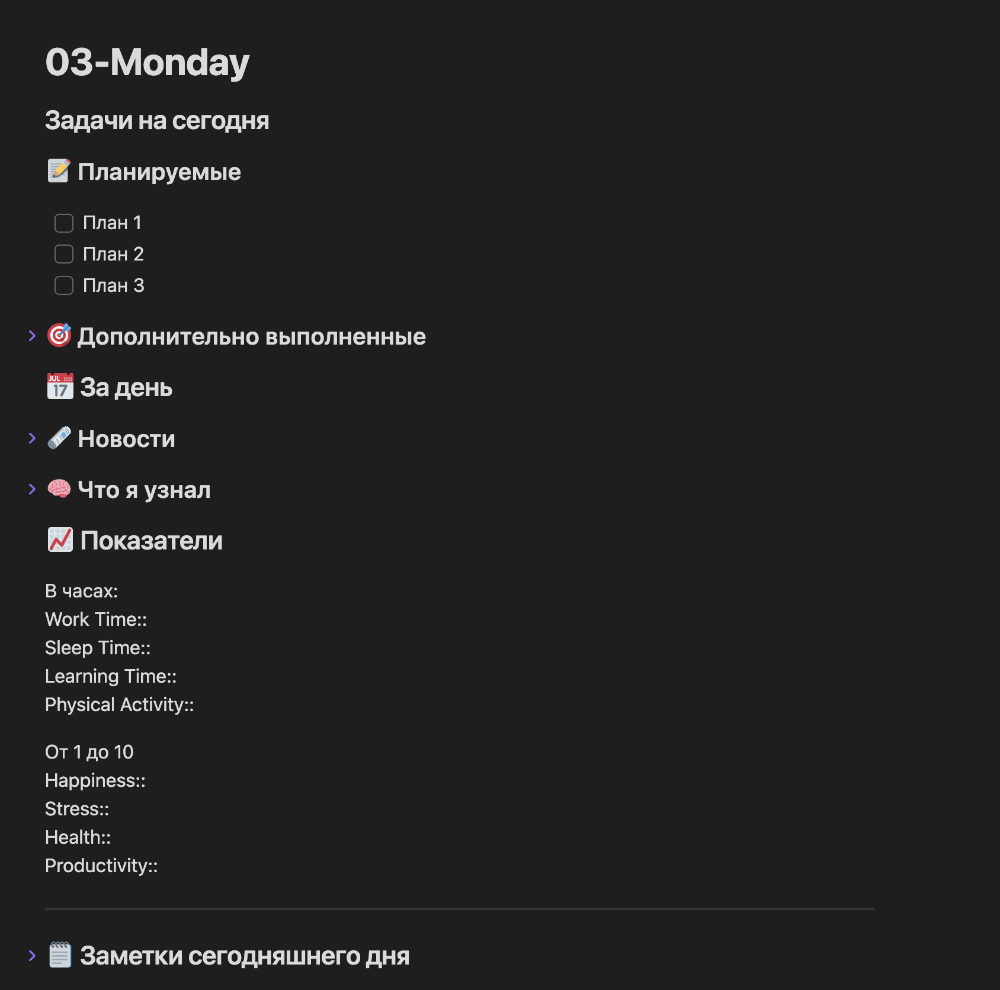
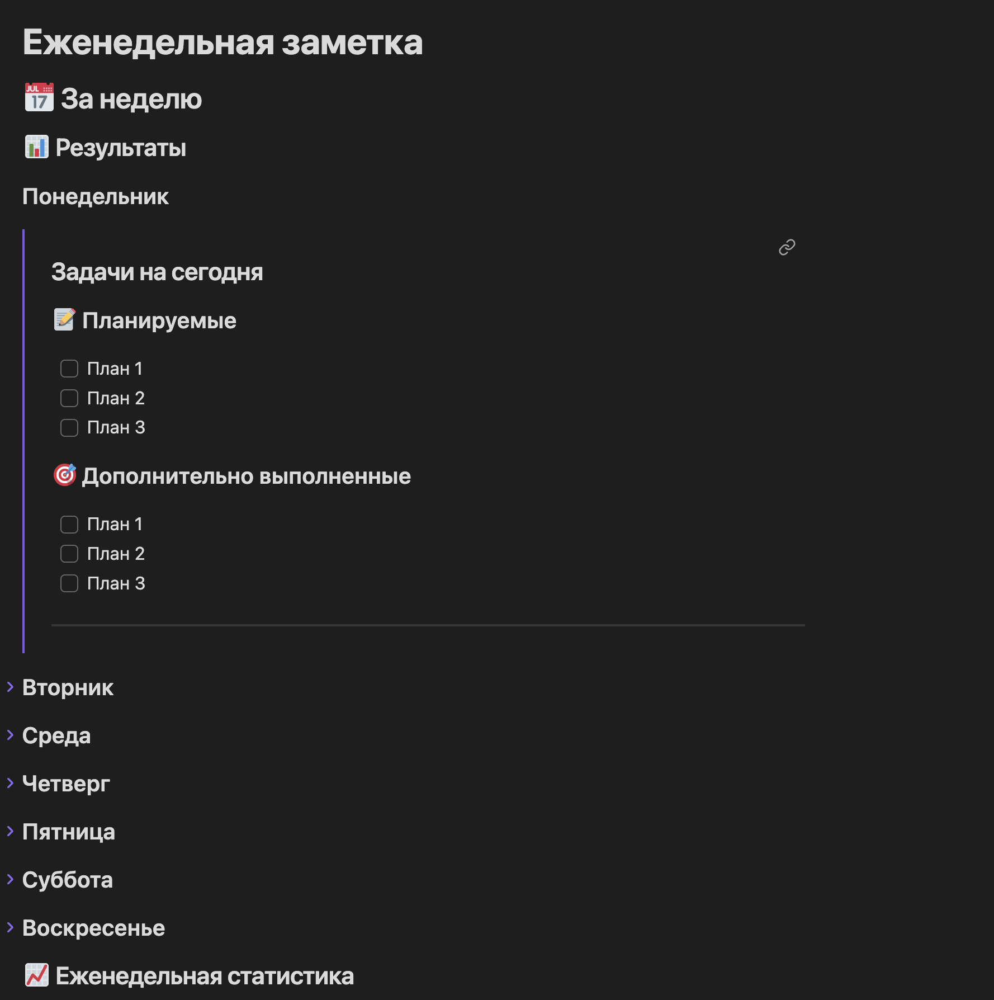
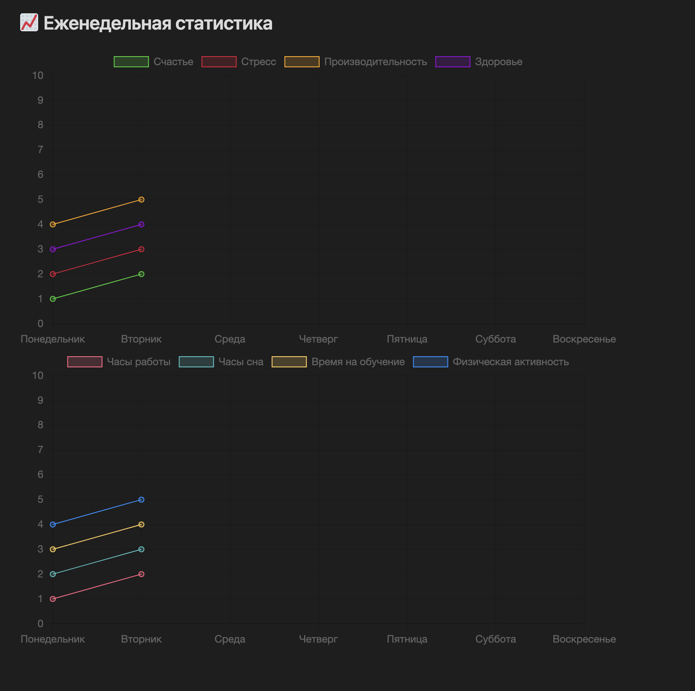

# Скрипты для управления заметками

В этом репозитории собраны скрипты, предназначенные для управления и организации ваших заметок. В частности, эти скрипты разработаны для работы с файлами Markdown в приложении для создания заметок Obsidian, но они также могут быть полезны для других аналогичных систем.

## Структура директорий

Скрипты организованы по различным категориям:

- `/notes_management`: Скрипты, связанные с организацией и управлением файлами заметок.
- `/data_analysis`: Скрипты для анализа данных в ваших заметках.
- `/automation`: Скрипты для автоматизации повторяющихся задач в процессе создания заметок.

## Скрипты

### Сортировщик по датам Obsidian (`Scripts/notes_management/Obsidian_monthly_migrator.py`)

Этот скрипт переорганизует ваши ежедневные заметки в месячные папки. Он ищет файлы Markdown в формате `YYYY-MM-DD.md` и перемещает их в соответствующую папку `YYYY-MM`. Если папка не существует, он создает ее.

Чтобы использовать этот скрипт, перейдите в директорию, содержащую ваши заметки, и запустите скрипт с помощью Python:

```bash
python3 ./Scripts/notes_management/Obsidian_monthly_migrator.py
```

### Нахождение неиспользуемых файлов (`Scripts/data_analysis/Unused_files_finder.py`)

Этот скрипт ищет файлы заметок (в формате `.md`), которые не имеют ссылок на них из других заметок. Результат работы скрипта - это новый файл `unused_files_report.md` в директории `Reports`, который содержит список неиспользуемых файлов с ссылками на них в формате Obsidian.

Чтобы использовать этот скрипт, перейдите в корневую директорию вашего хранилища Obsidian и запустите скрипт с помощью Python:

```bash
python3 ./Scripts/notes_management/Unused_files_finder.py
```

Пожалуйста, обратите внимание, что скрипт анализирует все файлы и папки рекурсивно начиная с директории, где он находится. Если ваше хранилище содержит вложенные папки, все они будут проанализированы.

### Автоматическое создание заметок из RSS (`/automation/RSS_to_markdown_cleanup.py`)

Этот скрипт автоматически создает новые заметки из статей, на которые вы подписаны через RSS(https://tproger.ru/feed/). Скрипт переводит содержимое RSS-ленты в формат Markdown, подходящий для использования в Obsidian или других приложениях для ведения заметок.

Чтобы использовать этот скрипт с другим источником, вам потребуется изменить URL RSS-ленты. Скрипт настроен что заметки будут создаваться в корневой директории Obsidian. Перейдите в директорию и запустите скрипт с помощью Python:

```bash
python3 ./Scripts/automation/RSS_to_markdown_cleanup.py
```

**ВАЖНО!**

Установить модули перед запуском
```bash
pip3 install feedparser
pip3 install bs4
pip3 install html2text
```

## Шаблоны
### Установка
Сначала установите эти расширения, без них скорее всего это работать не будет

**Templater**: Используется для динамического изменения некоторых текстовых элементов в файлах во время генерации.
Вам нужно будет зайти в настройки и включить опцию "Запуск Templater при создании нового файла", чтобы эта конфигурация работала.

**Obsidian Calendar**: Используется для создания ежедневных и еженедельных заметок.
По желанию можно использовать Periodic Notes, которые кажутся гораздо более настраиваемыми и мощными, но это кажется излишним для моих целей.

**Obsidian Charts** & **Obsidian Dataview**: Используются для визуализации и обработки ваших еженедельных данных.

Затем вам придется определить, как будут форматироваться ваши заметки, в настоящее время по умолчанию установлен следующий формат:

- Заметки
    - YYYY
        - Неделя W
        - DD-dddd

Еженедельные заметки Если вы хотите его изменить, вам, возможно, придется поработать с кодом templater (который, по правде говоря, довольно кривоват, потому что я постоянно сталкивался с проблемами)
чтобы применить настройки по умолчанию

### Настройка

- перейдите в ежедневные заметки
    - Установите новое расположение файла как Заметки/
    - добавьте YYYY/[Week] w/DD-dddd в формат даты

- перейдите в календарь
    - Включите номера недели
    - добавьте YYYY/[Week] w/[Weekly Notes] в формат еженедельной заметки

Наконец, вы можете скопировать файлы шаблонов в свое хранилище, скопировать/скачать/клонировать файлы шаблонов в каталог Заметки/, затем установить соответствующие файлы как шаблоны в настройках.

### Примеры
Шаблон ежедневной заметки


Шаблон еженедельной заметки


Шаблон ежедневной заметки

## Примечания

Эти скрипты предоставляются "как есть", без каких-либо гарантий. Они были тщательно протестированы, но, как и любой код, могут содержать ошибки. Всегда делайте резервные копии ваших данных перед использованием этих скриптов.

Если вы находите ошибки или у вас есть предложения по улучшению, не стесняйтесь открыть проблему в этом репозитории.
